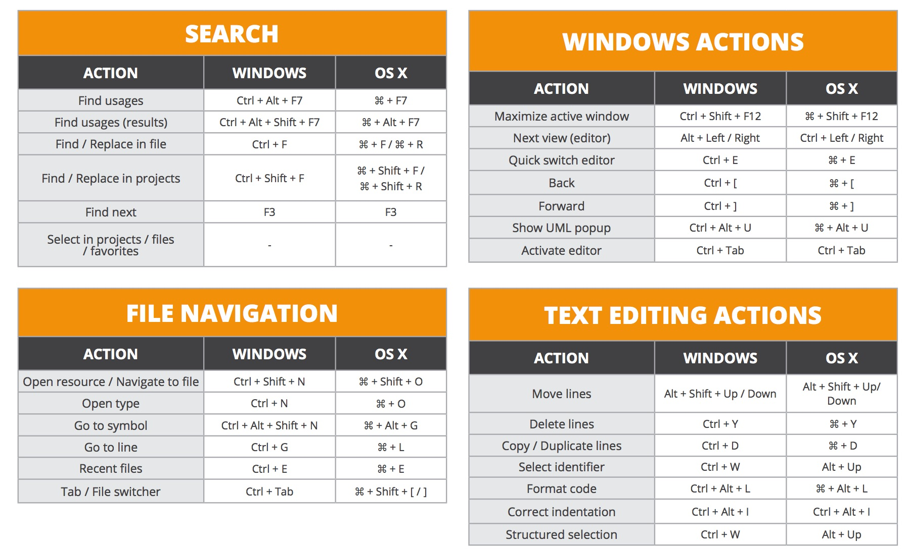
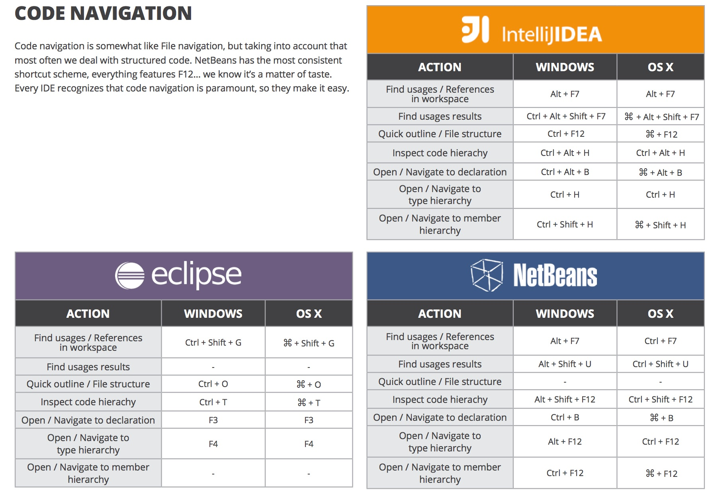
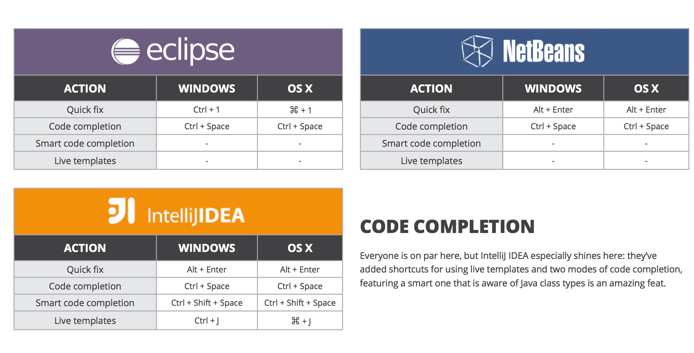
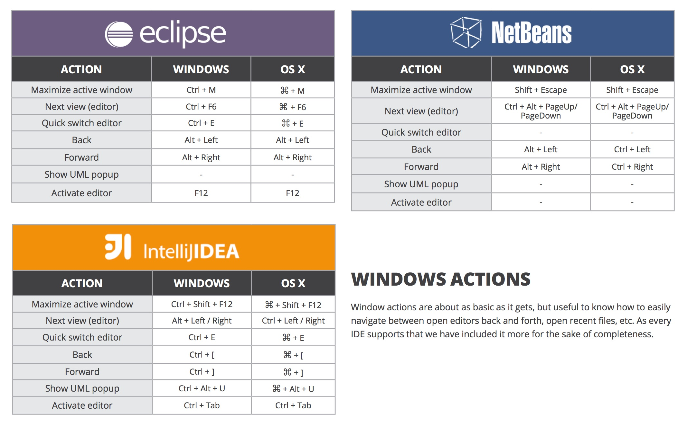
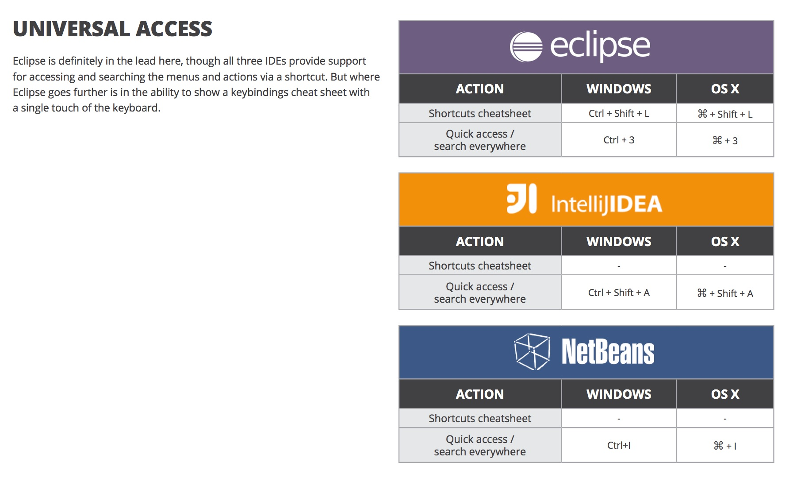

JAVA开发离不开IDE，IDE使用也离不开快捷键，一下是一些常用的快捷键.

## IDEA 快捷键

## Search 快捷键对比

## Code navigation 快捷键对比

## Code completion快捷键对比

## windows actions 快捷键对比

## refactor 快捷键对比

## universary access 快捷键对比

