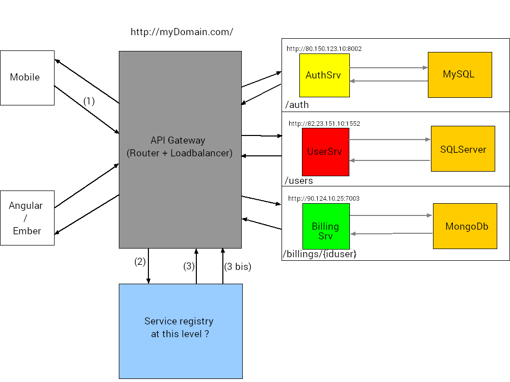

一篇stackoverflow上面关于microservice的问答，觉得挺适合我自己的，刚好也比较感兴趣，就先留个位置
[microservice-service-registry-api-gateway-and-data-sharing](http://stackoverflow.com/questions/29669180/microservice-service-registry-api-gateway-and-data-sharing?rq=1)

这篇文章里面自己觉得需要进一步了解的是：

 - 有一张图：

 
 
 - 非HTTP协议的通信(AMQP......)
 - HATEOAS pattern
 - Service Registries like Zookeeper,Eureka
 - tools like Netflix's Hystrix helps to fallback
