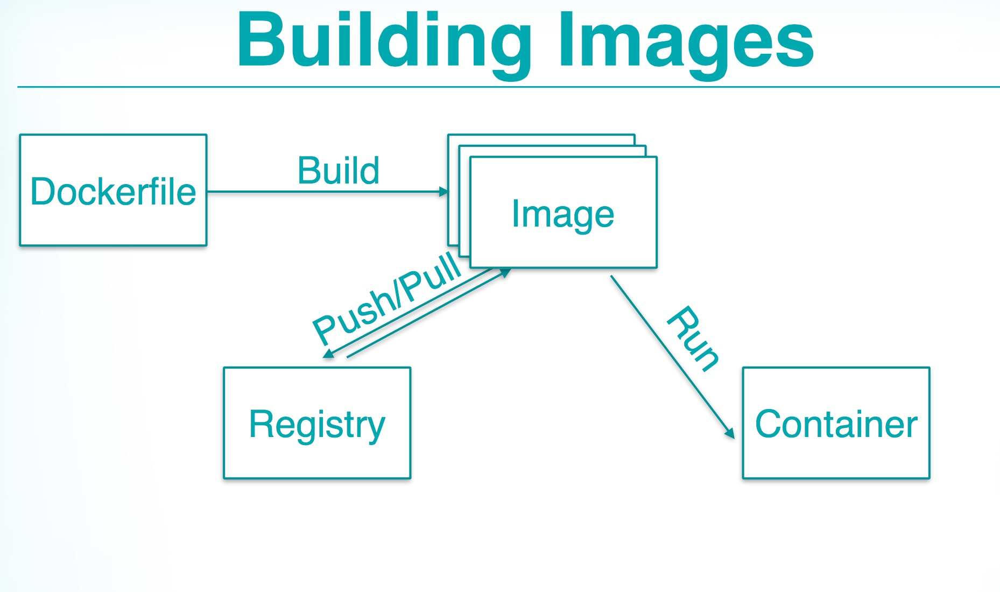

Docker 基本概念的解释

## Docker dictionary - Container
Docker Container is:

- A running instance of your app and it’s complete software stack
- Often runs just one process
- You might have many identical containers running

## Docker dictionary - image
Docker Image is:

- Docker uses a layering system to optimize storage
- Each line in your Dockerfile is a layer
- Many layers make up an image
- Images share common layers where possible

## Docker dictionary - Dockerfile
Docker Dictionary - Dockerfile

- The Dockerfile is a text file that lives in your project root
- Describes how to build your image
- Installs software packages, configures runtimes, etc
- Tells Docker what command to run and what ports to open

## Docker Dictionary - Registry
Docker Dictionary - Registry

- A server that stores images
- Provides organization and authentication as needed
- Facilitates sharing of pre-built images

## Docker Binary
- Both the CLI client and the server
- Written in Go
- Speaks REST-ish over Unix socket or TCP/SSL
- CLI and server can be on different hosts

## Docker Building Images

## How Containers run
- Docker daemon runs as root and starts containers
- Containers are basically stateless
- Can expose local storage if you need to
- Can’t see each other’s files
- State is gone on exit

## Dockerfiles
- FROM - specify your base image
- RUN - run commands in the context
- ADD - put your files in
- EXPOSE - listen on ports
- ENV - set enviroment vars
- VOLUME - persistent storage

## Tools Chain
- Vagrant
- systemd
- CoreOS
